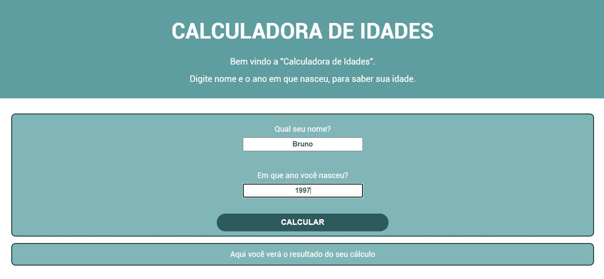
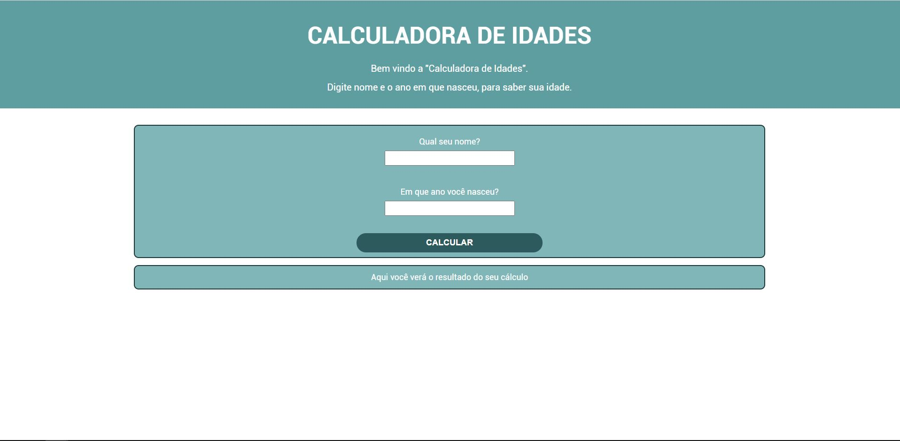
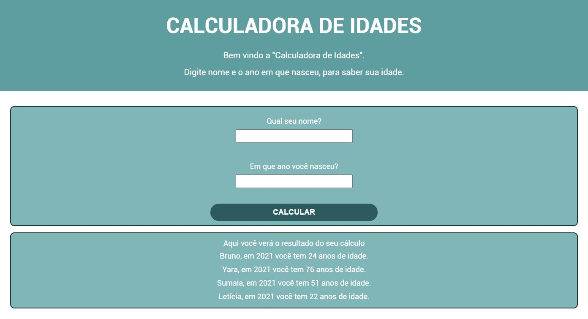

# Calculadora de Idades
## Recriando meu projeto de "Calculadora de Idades", dessa vez usando HTML, CSS e JavaScript

Hora de refazer um dos meus primeiros projetos, mas dessa vez com mais conhecimento em HTML, CSS e JS.

A ideia é criar uma Calculadora de Idades.

Um projeto simples, mas meu objetivo é:

- escrever código todos os dias;
- fazer o projeto em 7 dias (até sábado 25/09/2021);
- por em prática meus novos conhecimentos e aprendizados;
- ganhar um pouco de independência ao tentar escrever o código sem assistir as aulas da Alura;
- ganhar a prática de pesquisar e entender soluções para meus códigos;

O projeto original foi criado usando apenas JavaScript, com as perguntas sendo feitas através de prompt de comando.

Agora, ao incrementar o HTML e o CSS no projeto, o desafio foi fazer o código funcionar com os mesmos objetivos, mas tornando ele bonito e incrementado ao visual do site.

[Visualizar projeto](https://brunosabbagmachado.github.io/calculadora-de-idades/)

Tela inicial:

Tela com resultados:

